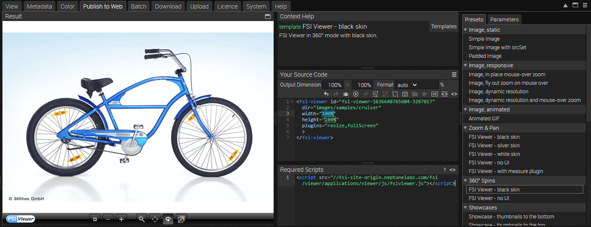
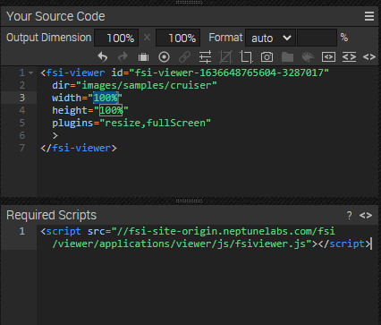

# Using FSI Viewer for 360° Showcase Image Zoom - Points Of Interest

This readme describes how a simple detail page 360° sample including Points Of Interest with *FSI Viewer* is achieved.
The aim of the demo is to show how you can easily integrate spin images with zoom by just adding a simple viewer tag.
The points of interest are achieved by using FSI ThumbBar.

# Add your images/ assets to FSI Server

First, you'll need to upload the images you want to use to FSI Server.
You can install a [demo version](https://www.neptunelabs.com/get/) via Docker or use our [online demo server](https://demo.fsi-server.com/fsi/interface/) to try it out first.

# Uploading images

There are several possibilities to upload images into the interface.


- Choose the Upload tab, click the "Choose files" button to add files to upload to the list. The files will be uploaded to the current folder.
- Drag & Drop files to the file view or the tree view

# Use 360° spin & zoom on the website

While having an image selected, you can see all possible publishing ways for the specific item by visiting the "Publish To Web" tab.
For this example, select the preset *FSI Viewer - black skin* in the section *360° Spins*:



The *Source Code* section enables you to control the look of your viewer by setting the dimensions and format, as well as adding effects or crop options to it.
In this area you also can see the source code for your selected publishing option which you can edit and copy to publish the images.
You also see the required scripts which need to be embedded on the site.



In order to display 360° zoom with FSI Viewer, you only need to add the corresponding script
to the head of your website:

```html
<script
  src='https://docs.neptunelabs.com/fsi/viewer/applications/viewer/js/fsiviewer.js'
</script>
```
This ensures that FSI Viewer is loaded.

Afterwards, you need to place the *<fsi-viewer>* tag you see in the Publish section on the place where you would like to see the viewer.
In our example this will look like this:

```html
   <fsi-viewer
  id="FSI_EDBeF84CxSVR"
  width="80%"
  height="100%"
  ir="/images/samples/cruiser/"
  backgroundColor="#f8f9fa"
  cfg="showcase_presets/showcase-cruiser.xml"
  plugins="Resize,FullScreen">
</fsi-viewer>
```

The difference between the normal 2D viewer and the 360° viewer is that the latter uses *dir* instead of *src*.

Now we want to have some points of interest. This is achieved by setting them in an XML configuration.
This is discussed in a tutorial on our website: [Points Of Interest Tutorial](https://www.neptunelabs.com/fsi-viewer-js/multiple-spins-showcase/).

The resulting viewer with thumbbar looks like this:

```html
<div id="Container_FSI_EDBeF84CxSVR" style="position:relative;width:100%;height:700px;box-sizing:border-box;padding-right:200px;">
          <fsi-viewer id="FSI_EDBeF84CxSVR" width="80%" height="100%" debug="true" dir="/images/samples/cruiser/" backgroundColor="#f8f9fa" cfg="showcase_presets/showcase-cruiser.xml" plugins="Resize,FullScreen" fullScreenElement="Container_FSI_EDBeF84CxSVR">
          </fsi-viewer>
          <fsi-thumbbar viewerSelector="FSI_EDBeF84CxSVR" width="20%" height="100%" debug="true" style="position:absolute;bottom:0px;height:100%;width:200px;left:728px; text-align: center" cfg="showcase_presets/showcase-cruiser.xml" autoElementSpacing="true" elementWidth="20%" vertical="true"></fsi-thumbbar>
        </div>
```

For all parameters which can be used, please consult the [manual](https://docs.neptunelabs.com/fsi-viewer/latest/fsi-viewer).

## Testing with examples from your own server

To test the examples with images from your own [FSI Server](https://www.neptunelabs.com/fsi-server/), please first copy the env.yml.dist file to env.yml and adapt the file, then restart the main demo again.
