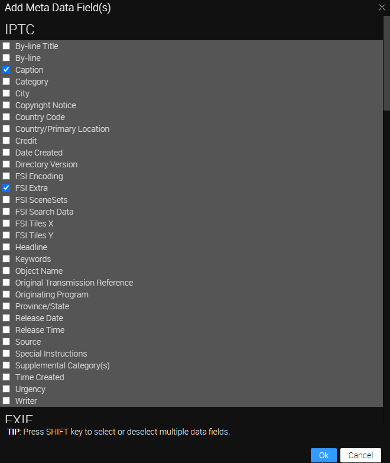

# Portfolio - Using FSI Showcase with metadata

This readme describes how to create a portfolio showcase using FSI Viewer and FSI
The aim of the demo is to show how you can easily integrate an image grid with metadata and zoom by just adding two simple custom tags.
two simple custom tags.

To display the Showcase, simply add the following scripts to the head of your website:

```html
<script src="//fsi-site.neptunelabs.com/fsi/viewer/applications/viewer/js/fsiviewer.js"></script>
<script src="//fsi-site.neptunelabs.com/fsi/viewer/applications/touchzoom/js/fsitouchzoom.js"></script>
<script src="//fsi-site.neptunelabs.com/fsi/viewer/applications/thumbbar/js/fsithumbbar.js"></script>
```

This will ensure that the viewers are loaded.

Next, you need to place the tags you see in the Publish section where you want the viewer to appear.
In our example, this will look like this

```html
<div
  style="width:100%;height:100%;display:flex!important;flex-direction:column!important;flex-wrap:nowrap!important;"
  id="fsi-showcase-1638202879465-5456242"
>
  <fsi-viewer
    id="fsi-viewer-1638202879466-1436698"
    style="flex: 1 1 100%;"
    width="100%"
    height="100%"
    skin="white"
    plugins="resize,fullScreen"
    fullScreenElement="fsi-showcase-1638202879465-5456242"
  >
  </fsi-viewer>
  <fsi-imagegrid
    style="flex: 1 1 60%;min-height:140px;"
    width="100%"
    height="100%"
    dir="images/samples/grid/landscape"
    cellWidth="300"
    cellHeight="125"
    useTouchZoom="true"
    useQuickZoom="false"
    autoCrop="cc"
    viewerSelector="#fsi-viewer-1638202879466-1436698"
  >
    <fsi-imagegrid-template style="display:none">
      <div class="myImageGridTitle">
        <span>###iptc.Caption###, ###iptc.FSI Extra###</span>
      </div>
      <div class="myImageGridImage">
        
      </div>
      <div class="myImageGridText"></div>
    </fsi-imagegrid-template>
  </fsi-imagegrid>

  <style>
    fsi-imagegrid .fsi-imagegrid-root .myImageGridTitle {
      padding: 0 4px;
      font-size: 11px;
      text-align: center;
      height: 20px;
      line-height: 20px !important;
      background-color: #000;
      color: #999;
      overflow: hidden;
      text-overflow: ellipsis;
      white-space: nowrap;
    }

    fsi-imagegrid .fsi-imagegrid-root div.myImageGridImage {
      height: calc(100% - 20px);
      background-color: #ddd;
    }
  </style>
</div>
```

For all the parameters that can be used, please refer to the [manual](https://docs.neptunelabs.com/fsi-viewer/latest/fsi-viewer).

## Displaying metadata

In our example, we have added some labels below the thumbnails in the image grid.
This is achieved by adding the following part

```html
<fsi-imagegrid-template style="display:none">
  <div class="myImageGridTitle">
    <span>###iptc.Caption###, ###iptc.FSI Extra###</span>
  </div>
  <div class="myImageGridImage">
    
  </div>
  <div class="myImageGridText"></div>
</fsi-imagegrid-template>
```

The div with the ImageGrid title contains the metadata Caption and FSI Extra.
To add this metadata, go to the _Metadata_ tab, click on the three tiles on the right and select **Add Fields**:


Tip: If you do this with multiple images selected, the fields will be added to them, making it more convenient.

We have added Caption and FSI Extra:



You can then enter any information you wish to display in the fields:


## Testing with examples from your own server

To test the examples with images from your own [FSI Server](https://www.neptunelabs.com/fsi-server/), please first copy the env.yml.dist file to env.yml and adapt the file, then restart the main demo again.
